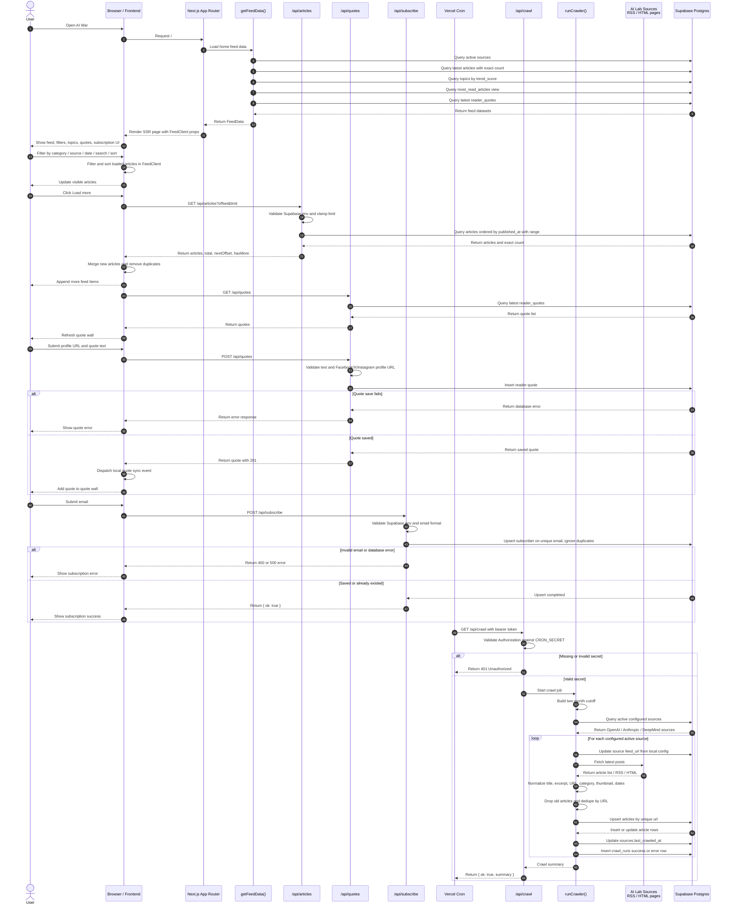

# AI War — Project Context for AI Builder

## 1. Project Summary

**AI War** is a curated AI news aggregation product.

The product collects, normalizes, and displays articles, announcements, research updates, model releases, safety posts, and product news from major AI laboratories.

Initial tracked sources:

- OpenAI
- Anthropic
- Google DeepMind

The goal is to give AI researchers, builders, product people, founders, and AI enthusiasts one clean place to follow important updates from top AI labs instead of manually checking multiple company blogs.

---

## 2. Product Positioning

AI War should feel like:

> A live, curated intelligence feed for important AI lab updates.

It is not a generic news website.  
It is not a social media feed.  
It is not a long-form blog platform.

It is a focused product that answers:

> “What did the major AI labs publish recently, and what matters right now?”

---

## 3. Target Users

### Primary Users

1. **AI researchers**
   - Want to follow research papers, safety updates, benchmark releases, and technical reports.

2. **AI engineers and practitioners**
   - Want to track new model releases, API updates, tooling changes, and implementation-relevant announcements.

3. **Founders and product builders**
   - Want to understand what the leading labs are building, announcing, or prioritizing.

4. **AI enthusiasts and analysts**
   - Want a fast way to stay updated without manually checking multiple websites.

---

## 4. Core User Problems

Users currently need to check multiple separate sources:

- OpenAI blog
- Anthropic news/research pages
- Google DeepMind blog
- Product release notes
- Research announcement pages
- Safety/system card posts

This creates several problems:

- Updates are fragmented.
- It is hard to compare what different labs are publishing.
- Important posts may be missed.
- Users cannot easily filter by lab, category, topic, or date.
- There is no simple “live view” of recent AI lab activity.

AI War solves this by combining all tracked sources into one structured, filterable, searchable feed.

---

## 5. MVP Goal

The MVP should deliver a working feed that can:

1. Crawl articles from the initial AI lab sources.
2. Save normalized article data to Supabase.
3. Display articles in a clean feed UI.
4. Allow users to filter by source.
5. Allow users to filter by category.
6. Allow users to filter by date range.
7. Allow users to search articles.
8. Show trending topics.
9. Show most-read articles.
10. Allow newsletter subscription.
11. Show last crawl status.
12. Deploy reliably through GitHub and Vercel.

---

## 6. Product Scope

### In Scope for MVP

- Landing/feed page.
- Sticky navigation bar.
- Hero status strip showing tracked labs.
- Live article feed.
- Featured card for most recent article.
- Compact cards for remaining articles.
- Source filter.
- Category filter.
- Date range filter.
- Global search input.
- Trending topic pills.
- Newsletter subscription module.
- Footer with last crawl timestamp.
- Supabase database.
- Vercel deployment.
- GitHub repository.
- Scheduled crawl job.

### Out of Scope for MVP

- User login.
- Personalized feed.
- Bookmark/save article.
- Comments.
- User profiles.
- Admin dashboard.
- Paid subscriptions.
- AI-generated summaries.
- Semantic/vector search.
- Push notifications.
- Multi-language support.
- Complex analytics dashboard.

These can be considered later versions.

---

## 7. Design Direction

The UI should be light-themed, modern, and focused and follow the in [DESIGN SYSTEM](./DESIGN.md).
and use the logo for the website in [Main Logo](./Aiwar_logo.png).


### Layout

Desktop layout:

```txt
Top Navigation
Hero Status Strip

Left Sidebar        Center Feed            Right Sidebar
Date Filters      compact Article       Trending Topics
Category Filters           
Sources Filter                               
```

Mobile layout:

```txt
Top Navigation
Hero Status Strip
Feed
Filters may collapse or stack
Right sidebar content can be hidden or moved below feed
```

---

## 8. Main Product Entities

## 8.1 Article

An article is the core content object.

Recommended fields:

```ts
type Article = {
  id: string;
  title: string;
  excerpt: string | null;
  url: string;
  source_id: string;
  source_domain: string | null;
  author: string | null;
  category: ArticleCategory | null;
  thumbnail_url: string | null;
  published_at: string | null;
  crawled_at: string;
  created_at: string;
};
```

## 8.2 Source

```ts
type Source = {
  id: string;
  name: "OpenAI" | "Anthropic" | "Google DeepMind";
  domain: string;
  color: "green" | "orange" | "blue";
  is_active: boolean;
  last_crawled_at: string | null;
  created_at: string;
};
```

## 9.3 Topic

```ts
type Topic = {
  id: string;
  name: string;
  trend_score: number;
  created_at: string;
};
```

## 9.4 Subscriber

```ts
type Subscriber = {
  id: string;
  email: string;
  subscribed_at: string;
};
```

---

## 10. Article Categories

Initial categories:

# Standardized Content Categories

| Standard Category | Used For | OpenAI Coverage | Anthropic Coverage | Google DeepMind Coverage |
|---|---|---|---|---|
| **Announcements** | General news, newsroom updates, events, organizational updates, and posts that do not fit other categories | Company, All | Announcements | News, Company |
| **Models & Releases** | Model launches, model upgrades, benchmark releases, new capabilities, and major AI system announcements | Product, Research | Product announcements, Claude model releases | Models |
| **Product & Platform** | APIs, apps, developer tools, enterprise features, AI platforms, SDKs, and product ecosystem updates | Product, Engineering | Product | Models, Products |
| **Research** | Research papers, technical reports, evaluations, benchmarks, methods, and research previews | Research | Research-related posts | Research, Publications, Evals |
| **Science & Applications** | AI applications in science, healthcare, biology, climate, robotics, education, and real-world industry use cases | Research, AI Adoption | Healthcare/life sciences, Economic Index | Science |
| **Policy & Society** | AI governance, regulation, public policy, labor impact, economics, and societal implications of AI | Global Affairs, AI Adoption | Economic Index, Policy Updates | Responsibility & Safety, About |
| **Safety & Alignment** | AI safety, alignment, system cards, misuse prevention, preparedness, responsible AI, and security-related updates | Safety, Security | Safety, Policy, Responsible Use | Responsibility & Safety |
| **Company & Partnerships** | Company news, partnerships, acquisitions, hiring, government collaborations, and enterprise relationships | Company, Global Affairs | Announcements, Partnerships, Acquisition | Company, National Partnerships |


---

## 11. Key Screens

## 11.1 Feed Page

The main page contains:

- Sticky navigation
- Hero status strip
- Left sidebar filters
- Center article feed
- Right sidebar contextual modules

This is the most important screen.

## 11.2 Article Destination

For MVP, clicking an article can open the original article URL in a new tab.

## 11.3 Search Result Behavior

For MVP, global search can filter the existing feed using title, excerpt, source, and category.


---

## 12. User Flows

## 12.1 Browse Latest Articles

1. User opens AI War.
2. User sees tracked labs in the hero strip.
3. User sees latest article as featured card.
4. User scrolls through compact article cards.
5. User clicks an article.
6. System opens original article URL.

## 12.2 Filter by Source

1. User sees source filters in the left sidebar.
2. All sources are active by default.
3. User disables one source.
4. Feed removes articles from that source.
5. User enables it again.
6. Feed restores articles from that source.

## 12.3 Filter by Category

1. User chooses a category.
2. Feed updates to show only matching articles.
3. Active category is visually highlighted.

## 12.4 Filter by Date Range

1. User selects a start date.
2. User selects an end date.
3. Feed shows articles published within that range.

## 12.5 Search Articles

1. User types into the global search input.
2. Feed updates based on search query.
3. Empty state appears if no results match.

## 12.6 Subscribe to Newsletter

1. User enters email in newsletter box.
2. User clicks Subscribe.
3. System validates email.
4. System saves email to Supabase.
5. UI shows success or error message.


## 12.7 System Flow — Sequence Diagram

This section describes the main runtime flow of AI War.

The diagram shows how users load the SSR feed, filter the feed in the browser, load more articles through the API, submit reader quotes, subscribe by email, and how the protected crawler updates article data in Supabase.

### Main Components

- **User**: The person using AI War in the browser.
- **Browser / Frontend**: The client-side UI that renders the feed, filters, topics, reader quotes, and subscription form.
- **Next.js App Router**: The deployed application server and frontend host.
- **`getFeedData()`**: Server-side data loader used by the home page.
- **`/api/articles`**: API route used by the browser to load more paginated articles.
- **`/api/quotes`**: API route used to fetch and create reader quotes.
- **`/api/subscribe`**: API route for newsletter email subscription.
- **Vercel Cron**: The scheduled job runner that periodically calls the crawl endpoint.
- **`/api/crawl`**: A protected Next.js API route that starts the crawl process.
- **`runCrawler()` / Crawler Module**: Backend module inside the Next.js app. It is not a separate microservice in the MVP.
- **AI Lab Sources**: External RSS feeds and pages such as OpenAI, Anthropic, and Google DeepMind.
- **Supabase Postgres**: The main database for sources, articles, topics, article metrics, subscribers, reader quotes, and crawl runs.

### Mermaid Diagram



---

## 13. Functional Requirements

| ID | Requirement | Priority |
|---|---|---|
| FR-001 | App displays article feed from Supabase | Must |
| FR-002 | App crawls OpenAI, Anthropic, and Google DeepMind sources | Must |
| FR-003 | App stores normalized articles in Supabase | Must |
| FR-004 | App avoids duplicate articles by unique URL | Must |
| FR-005 | User can filter by source | Must |
| FR-006 | User can filter by category | Must |
| FR-007 | User can filter by date range | Must |
| FR-008 | User can search articles | Must |
| FR-009 | App shows featured latest article | Must |
| FR-010 | App shows compact cards for remaining articles | Must |
| FR-011 | App shows source badges and source colors | Must |
| FR-012 | App shows last crawl timestamp | Must |
| FR-013 | App shows trending topics | Should |
| FR-014 | App is responsive | Must |

---

## 14. Non-Functional Requirements

## 14.1 Performance

- Feed should load quickly.
- Avoid blocking page rendering with crawler operations.
- Use pagination or limit query size if article count grows.
- Keep API responses compact.

## 14.2 Reliability

- Crawler should not break the whole system if one source fails.
- Each source crawl should be isolated.
- Log crawl errors.
- Avoid duplicates using unique article URL.
- Store `last_crawled_at` per source.

## 14.3 Security

- Supabase service role key must only be used server-side.
- Do not expose service role key to browser.
- Protect crawl endpoint with `CRON_SECRET`.
- Validate newsletter email input.
- Use Row Level Security if exposing direct browser queries.

## 14.4 Accessibility

- Use readable contrast.
- Use semantic HTML.
- Ensure clickable items have clear labels.
- Search input and date fields should have visible focus state.
- Color should not be the only source indicator.

---

## 15. Recommended Tech Stack

- **Framework:** Next.js App Router
- **Language:** TypeScript
- **Styling:** Tailwind CSS
- **Database:** Supabase Postgres
- **Deployment:** Vercel
- **Version Control:** GitHub
- **Crawler:** Next.js Route Handler + Vercel Cron
- **Validation:** Zod
- **Parsing:** RSS parser / Cheerio depending on source format

---

## 16. Environment Variables

The AI builder should expect these variables:

```env
NEXT_PUBLIC_SUPABASE_URL=
NEXT_PUBLIC_SUPABASE_ANON_KEY=
SUPABASE_SERVICE_ROLE_KEY=
CRON_SECRET=
```


## 17. Supabase Context

Supabase is used as the main backend database.

Required tables:

- `sources`
- `articles`
- `topics`
- `article_topics`
- `subscribers`

Important database behavior:

- `articles.url` should be unique.
- Articles should be upserted by URL.
- Source should be referenced by `source_id`.
- Each source should track `last_crawled_at`.
- Newsletter emails should be unique.

---

## 18. Vercel Context

Vercel is used for hosting and scheduled jobs.

Expected Vercel usage:

- Deploy Next.js app from GitHub.
- Store environment variables in Vercel Project Settings.
- Use Vercel Cron to call `/api/crawl`.
- Use production branch as `main`.

Suggested cron schedule:

```json
{
  "crons": [
    {
      "path": "/api/crawl",
      "schedule": "*/30 * * * *"
    }
  ]
}
```

This means the crawler runs every 30 minutes.

---

## 19. GitHub Context

GitHub is used for source control and AI coding workflow.

Recommended branch strategy:

```txt
main              production
feature/setup     initial project setup
feature/database  Supabase schema and queries
feature/feed      article feed UI
feature/crawler   crawler implementation
feature/filters   source/category/date/search filters
feature/newsletter newsletter module
```

Commit style examples:

```txt
feat: initialize Next.js project
feat: add Supabase schema
feat: build article feed
feat: add source filters
feat: implement crawl endpoint
fix: prevent duplicate article insert
```

---

## 20. AI Builder Instructions

When building this project, prioritize in this order:

1. Create a working Next.js project.
2. Add Supabase connection.
3. Create database schema.
4. Seed source data.
5. Build static UI layout.
6. Build API to fetch articles.
7. Build article feed from Supabase.
8. Add filters.
9. Add crawler endpoint.
10. Add Vercel Cron config.
11. Add newsletter subscription.
12. Add responsive polish.

Do not start with advanced features like AI summaries, authentication, semantic search, or dashboards.

The first goal is a working, deployed MVP.

---

## 21. Implementation Guardrails

The AI builder should follow these rules:

- Do not expose Supabase service role key in client components.
- Keep crawler server-side only.
- Use TypeScript types for core data objects.
- Keep components small and reusable.
- Keep UI consistent with the light theme defined in [DESIGN SYSTEM](./DESIGN.md).
- Make source attribution visible on every article card.
- Make filter states obvious.
- Add empty states for no articles and no search results.
- Add loading states for feed fetch.
- Handle crawler failure gracefully.
- Use environment variables, not hardcoded credentials.

---

## 22. Definition of Done

MVP is done when:

- Project runs locally with `pnpm dev`.
- Supabase schema exists.
- Sources are seeded.
- Articles can be inserted/upserted.
- Feed reads articles from Supabase.
- Latest article appears as featured card.
- Other articles appear as compact cards.
- Source filter works.
- Category filter works.
- Date range filter works.
- Search works.
- Newsletter email can be saved.
- Crawl endpoint is protected by secret.
- Vercel cron config exists.
- Project deploys successfully on Vercel.
- Environment variables are documented.
- README explains setup and deployment.

---

## 23. Future Roadmap

After MVP, consider:

1. AI-generated article summaries.
2. Semantic search with Supabase Vector.
3. Personalized source/topic preferences.
4. User accounts.
5. Bookmark/save article.
6. Weekly digest email.
7. More AI sources:
   - Meta AI
   - Microsoft Research
   - Mistral AI
   - xAI
   - Cohere
   - Perplexity
8. Topic pages.
9. Lab comparison dashboard.
10. Admin dashboard for crawler status.
11. Content quality scoring.
12. Public API.

---

## 24. One-Line Product Description

AI War is a live, curated feed that tracks and organizes important AI updates from OpenAI, Anthropic, and Google DeepMind in one searchable, filterable interface.
